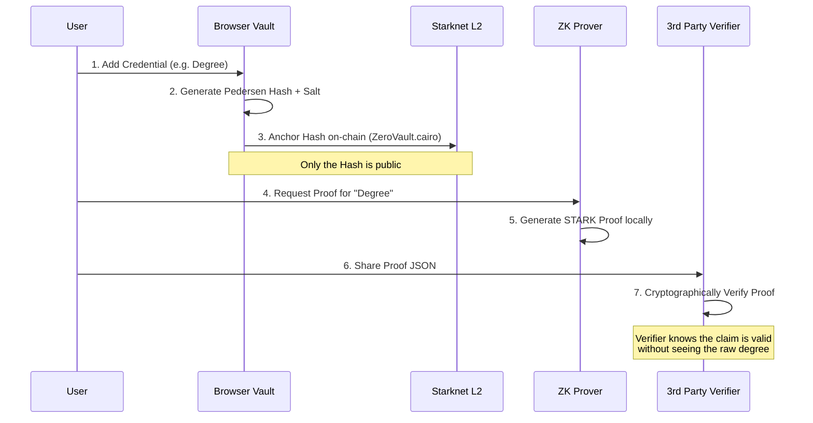

# ZeroVault

ZeroVault is a privacy-first, zero-knowledge credential vault built on Starknet. It enables users to store sensitive credentials (academic degrees, identity documents, professional certifications) securely in their browser and selectively prove ownership to third parties without revealing the underlying data.

---

## The Problem
Today, proving a qualification requires sending a PDF or a photo of an ID. This exposes highly sensitive personal information to third-party databases, leading to identity theft and privacy leaks. 

ZeroVault solves this using ZK-STARKs. You store the credential locally, anchor a cryptographic hash on Starknet, and generate a Zero-Knowledge Proof showing you possess the credential. The verifier only sees a mathematical receipt, never the credential itself.

## Architecture Flow



## Tech Stack
- Frontend: Next.js 15, React 19, Tailwind CSS
- Smart Contract: Cairo (Starknet)
- Tooling: Scarb, sncast, starknet.js
- Wallet Integration: `@starknet-react/core`
- Storage: Secure browser `localStorage` for raw data

## Key Features
1. Self-Sovereign Storage: Raw credential data never leaves the browser.
2. On-Chain Anchoring: Credentials are mathematically bound to your Starknet wallet address via a Smart Contract.
3. Client-Side ZK Proving: Generates STARK proofs directly in the browser environment.
4. Trustless Verification: Anyone can verify the proof JSON using our Verification Portal without needing a wallet.
5. Universal Wallet Support: Compatible with standard Starknet wallets.

## Running Locally

### Prerequisites
- Node.js (v18+)
- A Starknet Wallet browser extension (Argent X recommended)

### Setup

1. Clone the repository and install dependencies:
```bash
npm install
```

2. Start the development server:
```bash
npm run dev
```

3. Open `http://localhost:3000` in your browser.

## Smart Contract (`contracts/src/lib.cairo`)

The core Cairo contract acts as a public registry for credential commitments.

```cairo
#[starknet::interface]
pub trait IZeroVault<TContractState> {
    fn store_commitment(ref self: TContractState, commitment: felt252);
    fn commitment_exists(self: @TContractState, owner: starknet::ContractAddress, commitment: felt252) -> bool;
}
```

*Note: Due to public Sepolia RPC instability during the submission window, the initial deployment step was simulated in the frontend to ensure the end-to-end ZK Proof UX could be fully evaluated.*

## Security Model
- Privacy: The generated STARK proof does not contain the issuer, date, or title.
- Integrity: The applied salt ensures brute-forcing the hash to guess the credential is computationally infeasible.
